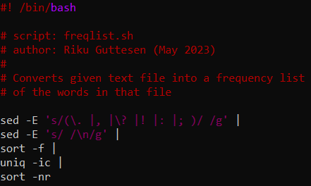
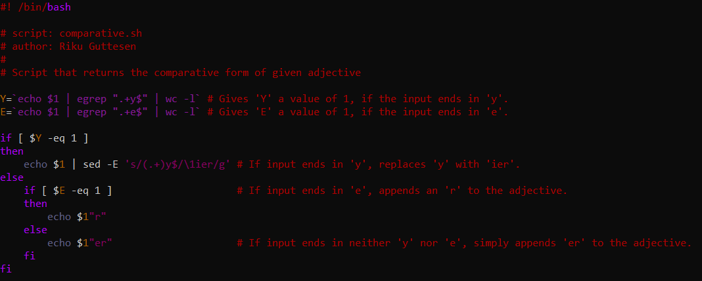
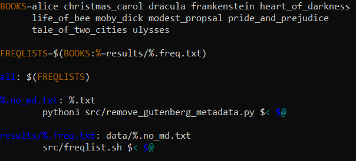

## Introduction

The Command Line is essentially a text-based user-interface, allowing the user to communicate with the computer textually rather than visually, which tends to be te norm these days. Using the Command Line does open up many new possibilites, however, and many of its functions are priceless when conducting, say, linguistic inquiry; in certain cases the functions are unusable outside the Command Line environment.

## Week 1: The Command-Line Environment

During the first week we were introduced to the command line environment and to some basic commands, such as `cat`, `mv` and `cp`. We also learned about directories: how to navigate directories with `cd`, make directories with `mkdir` and remove them with `rmdir`. During the quiz of the week, we were also tought the `echo` command along with output redirection using `>`.

## Week 2: UNIX

During this week we learned about access permissions: a file can have three levels of permissions - read, write, execute - for three different entities - user, group, other. The access permissions of a file can be easily viewed with `ls -l`, and the permission can be represented either symbolically (e.g. `-rw-rw-r--`) or numerically (e.g. `664`). Changing the permissions of a file can be done with the `chmod` command which can also be used symbolically or numerically; for example, giving read permission to everyone, write permission to the group, and execute permission to the user can be accomplished with both of these commands:
```
$ chmod 764 file.txt
$ chmod u+rwx,g+rw,o+w file.txt
```
Another theme of this week was processes. Using `top` you can see all processes that are currently running, along with their process ID, or PID; giving a PID after the command `kill -q` will termine the process of the given PID. Somewhat in the same vein, a command resulting in a lengthy process can be moved to the background using `&`, allowing the user to keep using the command prompt while the command is runnging. For example:
```
$ rm -R home &
```

## Week 3: Basic Corpus Processing

This week's material was definitely the most applicative to linguistic inquiry so far. We learned about the most common text encoding systems, such as ASCII and UTF-8, and also about converting files between different encodings with the `iconv` command; finding out the encoding type of a text file can be achieved with the `file` command, and line, word and byte counts can be checked with the command `wc`. The two most-used commands this week were unquestionably `sort` and `uniq`; the former sorts all lines in a text file in alphabetical order, and the latter removes duplicate lines from a text file. Common options used with these commands are `sort -f` and `uniq -i`, which both ignore case, `sort -n`, which sorts the lines numerically, `sort -r`, which sorts the lines in a reverse order, and `uniq -c`, which counts the duplicate lines instead of removing them.

## Week 4: Advanced Corpus Processing

This week we took our text-processing skills to a new level. We learned about "piping" commands using `|`, which allows you to chain multiple commands together in the command line; doing this with the commands learned last week, we are able to create, for instance, a list of word frequencies in a text file. But before attempting this, we still need to understand the `sed` command, which can be used to print, delete and replace text in a file using regular expressions. Let's consider the command down below:
```
$ sed -nE 's///g'
```
This command has the option `-nE`, which tells the command to print only matching lines and to use extended regular expression. The part `'s///g'` is used to replace the text that's between the first and second slash with the text that's between the second and third slah; of course, at this point the command does nothing since both spaces are empty, and we also need a file to be opened as input. Consider the full command below:
```
$ sed -nE 's/a/A/g' textfile1.txt > textfile2.txt
```
This command replaces all instances of lowercase a in textfile1 with a capital A and then saves that in a new textfile called textfile2. Now, Let's look at all the individual steps we have to do in order to create a word-frequency list of a textfile:
1. Remove punctuation so all words are only separated by spaces
2. Replace all spaces with new lines so all words have their own lines
3. Sort the file so that all words (i.e. lines) appear alphabetically
4. Count how many times lines appear in the file
5. Sort the file so that the highest number is at the top

Now we can finally have a look at the full command which turns creates a word-frequency list (textfile2.txt) of the words in textfile1.txt; notice how all steps in the list above are separated by the pipe in the command, and also that the `sed` command does not have the option `-n`, since we want to chain the entire input file between commands, not just the matching lines.
```
$ sed -E 's/(\. |, |\? |! |: |; )/ /g' testfile1.txt | sed -E 's/ /\n/g' | sort -f | uniq -ic | sort -nr  > testfile2.txt
```

## Week 5: Scripting

This week's material was a natural and useful continuation of last week's; instead of piping commands into long chains every time a somewhat complicated task must be done, the commands can be entered into an individual script, so that the task can be accomplished any time by simply activating the script. For example, the script in the image below accomplishes the exact same thing as the last one give above; notice how all individual commands are on their own lines for improved readability: 



The first line indicates the script type and through what means it can be called; below that we see comments initiated by the hashtag symbol that therefore don't interfere with the commands themselves. Now, the script itself can be called from the command line in the following manner:
```
$ cat textfile.txt | bash freqlist.sh 
```
However, using parameters in scripts makes them more adaptable, as they can accomplish much more with the same ammount of input. The immage below showcases how the string `$1` can be used to call the user's input in the script. It is also an excellent demonstration of the "if" command, which executes the following command(s) if a given condition is met.



As long as the user has permission to execute the script (see week 2), it can also be called in the following manner:
```
$ ./comparative.sh immaculate
```
which returns, funnily, `immaculater`.

## Week 6: MAKE

On the following level of magnitude, we find make: scripts could be used to automate a profuse ammount of piped commands, and for automating an equally daunting number of scripts we have make. Fundamentally, the syntax of a Makefile - which contains the instructions for make - looks like this:
```
output: input1 input2
	command
```
where the `command` part is usually used to execute a premade script along with its own inputs and outputs. But just like with scripts, it is the ability to use variables that makes make make - yes, you read correctly - the process infinitely easier. The cursory table down below shows four of the most prominent variables:

|Variable|Referent|
|:------:|--------|
|  `$@`  | output |
|  `$<`  | input1 |
|  `$^`  | input1 + input 2 |
|   `%`  | two or more identical patterns |

With this knowledge we can tackle the rule in the Makefile script down below, which, keeping in with the theme so far, creates frequency lists of a whole library of text files:



Firstly, all the books are listed that make up the library. Then, on the following line, a path to the `results` folder and a `.freq.txt` extension is appended to all the books; the names of these files are now the same as the output of the final rule, so make jumps there: it wants to create all the frequency lists using the script `freqlist.sh` and the versions of the books without the metadata. However, these versions do not exoit yet, so make has to create them first with the rule above using the python script `remove_gutenberg_metadata.py` and the text files of all the books - which ought to exist. Finally, the all rule refers back to `FREQLIST` on the second line and so runs through the whole Makfile. So, using the command below in the commandline, we will be created frequency lists of all these books in the results folder:
```
$ make all
```

## Week 7: Version Control

Version control is practically paramount to use when working on a large project. In essence, using version control means having a software track a selected file or directory along with all the changes made to it. This allows you to revert to previous versions of project, while only storing one version in your system. This also comes in handy when collaborating with other people, as everyone can work on their own versions, or _branches_, without affecting the original. One of the most popular softwares for this is _git_ along with its social website _GitHub_, where users can share their work and copy others'.

Once _git_ is installed and set up and you have a _GitHub_ account, the fundamental commands in the table below will make version control possible:

|Git command    |Explanation|
|:-------------:|-----------|
|`git status`   |_shows working branch, as well as tracked and untracked files in the working directory_|
|`git add`      |_adds given file to the staging area, making it tracked_|
|`git reset`    |_removes given file from the staging are, making it untracked_|
|`git commit -m`|_commits the files in the staging area to the local repository_|
|`git log`      |_shows a log of all executed commits along with their individual number_|
|`git clone`    |_clones remote repository at given URL to specified folder_|
|`git branch`   |_creates a branch with given name_|
|`git branch -a`|_lists all branches in local and remote repository_|
|`git checkout` |_changes working branch to given branch_|
|`git pull`     |_pulls all changes since last pull into given local repository from given remote repository_|
|`git push`     |_pushes all commits in the given local repository into remote repository along with any messages_|

## Week 8: GitHub Pages

This was the final week of the Command-Line Tools course. During this week we started working on our final assignment, through which we were introduced to _GitHub Pages_. _GitHub Pages_ is a static site hosting service that allows users to publish their own website using a repository on _GitHub_. For individual users, the repository used for the website must be named **username.github.io**, after which the site will be available at **http(s)://username.github.io**. _GitHub Pages_ is compatible with HTLM, CSS, and JavaScript files.