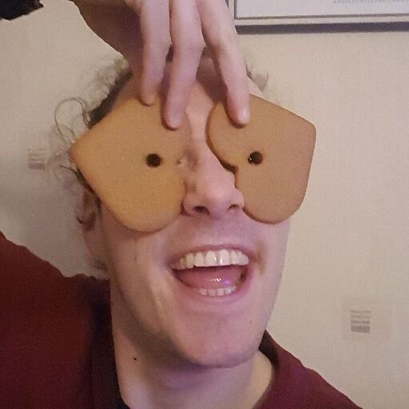

## Introduction

 Hi, you curious enough to find yourself reading my introduction, and welcome! My name is Riku, I'm a 24-year-old student at the University of Helsinki majoring in general linguistics. Apart from my morbid language fascination, I'm interested in music and hiking; I play the bass and the harmonica, and I try to regularly venture into the Finnish wilderness to spend a night or two "in the bush", as they'd say in New Zealand.

## Find me on

[Instagram](https://www.instagram.com/rigutchin/) & [GitHub](https://github.com/rguttesen), but don't bother.

## Contact

You can contact me through: riku.guttesen@helsinki.fi, or, if you still haven't entered the 21st century (good choice by the way), you can find me in Metsätalo on Tuesdays from 12-14 in front of lecture hall 4 where I'll be studying Italian. 

## Courses I've Taken

I'm cherry picking here; for a complete transcript with grades, please send 20 euros through Mobile Pay to user Riku Guttesen.

[Introduction to the Languages of the World and Language Typology](https://studies.helsinki.fi/courses/cu/hy-CU-117878478-2021-08-01), fall 2020

[Auditory Discrimination and Phonetic Notation](https://studies.helsinki.fi/courses/cu/hy-CU-118225814-2017-08-01), spring 2020

[Field Methods: Language description and documentation](https://studies.helsinki.fi/opintotarjonta/cur/hy-opt-cur-2223-0cbb79a6-9368-45e9-8b15-9b1bda7cebce), spring 2021

[Beginners' Course in Faroese](https://studies.helsinki.fi/courses/cur/hy-opt-cur-2122-6eec6a54-d057-4b2e-8b16-5a3629791d2e), fall 2021

## Projects

## Misc. 

Most hobbies of mine are rather musically oriented. Here are links to the online blues harmonica lessons I use; a collection of sheet music transcriptions from the first two generations of Pokémon games; and a link to the social dance courses organised by Hämäläis-Osakunnan Tansskikerho HOT.

[Blues Harmonica](https://www.bluesharmonica.com/home)

[Transcription of Pokémon Game Boy music](https://www.nayuki.io/page/transcription-of-pokemon-game-boy-music)

[Hämäläis-Osakunnan Tanssikerho](https://hamalais-osakunta.fi/toiminta/valiokunnat-ja-kerhot/kerhot/hamalais-osakunnan-tanssikerho)